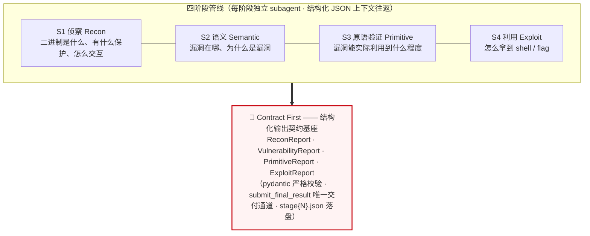
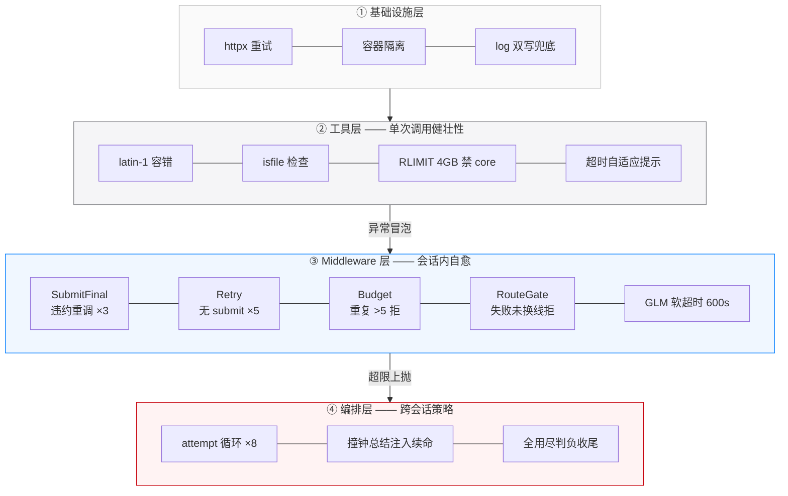

# LeanAgent

GLM-5.2 端到端自动打穿 CTF pwn 题：32 题过 30，十连跑零翻车，最快 9 分钟出 shell。
靠的不是更强的模型，而是 Agent 工程机制（输出契约 / 强制知识路由 / 撞钟总结续命 / 五层错误处理），把"模型该做却不会做"的事全部机制化。

基于 deepagents 的**二进制漏洞全自动利用** Agent（全程 GLM-5.2 驱动）。
32 题真实 CTF pwn 题实测 **30/32 = 93.75%**，十连跑稳定性 10/10。
架构详见 [docs/ARCHITECTURE.md](docs/ARCHITECTURE.md)。

## 编排总览：Contract-First 四阶段管线



## Agent Harness 设计：三层异常处理体系



**设计核心**：错误向上冒泡、策略向下注入；每层拒绝消息都附带"怎么做"（可执行指引）；
关键约束双保险（RouteGate 在工具闸门 + submit 终检各拦一次）。

## 工具设计原则与特色

### 设计原则：专用工具 > 裸 shell

LLM 拼 shell 命令是最大失败源（引号错误 / 输出爆炸 / 路径 typo 崩主进程）。
24 个专用工具统一处理三件事：**输出裁剪**（防上下文爆炸）、**编码容错**（latin-1
errors=replace）、**资源隔离**（子进程 RLIMIT）。

### 特色设计（如何提升调用准确性与效率）

| 特色 | 机制 | 对准确性的贡献 |
|---|---|---|
| **结构化输出** | `gdb_run_crash` 把崩溃解析成 JSON（signal/addr/bt），不吐原始 GDB 输出 | LLM 直接拿到结构化字段，零解析错误 |
| **make_payload** | `parts` 数组构造二进制：`[["A",48],["%p",1],["\x00",1]]` | JSON 字符串无法表达 NUL——格式串/ROP 题的唯一正确通道 |
| **自适应提示** | 断点未命中自动附 GDB-HINT（查 stdin 序列）；rc=-124 附"查 recv 同步点" | 把常见失败的排查方向直接喂给 LLM，省 3-5 轮盲试 |
| **输出摘要化** | `run_script` 只留标记行 + Traceback | 单次省 ~2K tokens，50 次/题 = **~100K tokens/题** |
| **写前检查** | `check_byte` 读目标地址既有字节（含 NUL/换行检测+警告） | "写后检查"翻车点的预防工具，写大 payload 前必查 |
| **批量查询** | `libc_offsets` 一次查 N 个符号偏移 | 替代 LLM 手写 readelf 管道，一次调用省 5+ 轮 |
| **max_lines 防爆** | symbols/sections/strings 全部带过滤器 + 行数上限 | 防单次工具输出撑爆上下文 |
| **交互实测** | `probe_io` 多步 recv_until/send 序列 + 子进程隔离 | 菜单时序靠实测不靠猜，target 崩溃不连带 agent |

---

# 项目数据汇总

> 数据来源：容器 /work/workspace 各题目 stage{N}.json 落盘时间 + /work/ctf(2)/_run_*.log 日志解析。
> 重试成功的题直接取最终成功轮的 S4；S1-S3 取首次完成轮。

## 一、32 题全阶段状态与时间

**图例**：时间为各阶段耗时；总耗时 = 启动 → 最终成功落盘；利用路线为最终成功路线。

| 题号 | 题目 | S1 | S2 | S3 | S4 | 结果 | 总耗时 | 利用路线 | 失败原因 |
|---|---|---|---|---|---|:---:|---|---|---|
| 0001 | ROP | 1m21s | 1m06s | 3m31s | 3m21s | ✅ | 9m21s | 栈溢出 → ROP | — |
| 0002 | Signature II | 1m50s | 1m40s | 10m18s | 2m36s | ✅ | 16m25s | 依赖链劫持（LD_LIBRARY_PATH + stub dlopen） | — |
| 0003 | Babyheap | 3m53s | 3m19s | 32m11s | 3h24m | ✅ | 4h03m | 盲注 oracle 二分泄露 + 堆利用 | — |
| 0004 | Heap | 2m07s | 1m28s | 59m44s | 3h47m | ✅ | 4h12m | House of Orange（off-by-one → unsorted bin attack → FSOP） | — |
| 0005 | Cage | 6m57s | 2m02s | 1h00m | 6m40s | ✅ | 1h16m | seccomp 沙箱逃逸 | — |
| 0006 | help-you-2 | 6m49s | 6m25s | 20m37s | 7m01s | ✅ | 40m53s | 栈溢出 → ret2libc | — |
| 0007 | seccomp2 | 1m27s | 1m15s | 4m10s | 4m52s | ✅ | 11m46s | seccomp + ORW ROP | — |
| 0008 | warmup | 1m10s | 1m07s | 13m39s | 1m38s | ✅ | 17m36s | 栈溢出 → ROP | — |
| 0009 | cooldown | 1m38s | 1m20s | 14m45s | 5m01s | ✅ | 22m45s | 栈溢出 → ROP | — |
| 0010 | fortunecookie1 | 2m47s | 2m40s | 20m02s | 27m05s | ✅ | 52m36s | 有符号整数下溢 → 逻辑绕过 | — |
| 0011 | fortunecookie2 | 1m48s | 5m23s | 31m06s | 17m44s | ✅ | 56m02s | 未初始化变量 → 逻辑绕过（方差重跑攻克） | — |
| 0012 | leaking | 3m17s | 1m39s | 9m03s | 22m34s | ✅ | 36m34s | 格式串泄露 → ROP | — |
| 0013 | mastermind | 1m58s | 7m39s | 45m02s | 4h06m | ❌ | 5h01m | sprintf 累积溢出 + 格式串 %n（探索） | 溢出够不到 canary；%n 无可用写目标；无官方解参照，8/8 attempt 打满未突破 |
| 0014 | positron | 7m59s | 6m40s | 41m39s | 2m06s | ✅ | 58m26s | 逻辑漏洞 → 直接拿 flag | — |
| 0015 | easyheap | 3m28s | 1m51s | 24m40s | 28m32s | ✅ | 58m32s | 堆溢出 → tcache/fastbin attack | — |
| 0016 | seccomp1 | 1m46s | 2m56s | 4m04s | 2m14s | ✅ | 11m01s | seccomp 绕过 | — |
| 0017 | shellcode-runner2 | 2m58s | 3m51s | 11m55s | 2m25s | ✅ | 21m11s | shellcode 注入绕过 | — |
| 0018 | wordle | 5m29s | 4m03s | 52m17s | 1h24m | ✅ | 2h25m | 负 size 下溢 → 线性页扫描盲定位 + stdin 缓冲区劫持（RouteGate 版 r5） | — |
| 0019 | uaf | 2m10s | 1m44s | 24m47s | 2m28s | ✅ | 31m10s | UAF → 堆利用 | — |
| 0020 | uaf2 | 2m06s | 2m05s | 28m13s | 2h22m | ✅ | 2h54m | UAF → 堆利用（attempt 6，hook .so 注入调试后收敛） | — |
| 0021 | echo | 2m35s | 1m54s | 1h00m | 4m04s | ✅ | 1h08m | 栈溢出（canary 泄露 + get_shell 直达 ROP） | 首轮 OOM 被杀（GDB 崩溃分析 15GB RSS）；RLIMIT 修复后重跑 PASS |
| 0022 | echo2 | 1m53s | 2m09s | 29m26s | 16m39s | ✅ | 50m08s | 栈溢出 → ROP | — |
| 0023 | absolute-winner | 3m39s | 2m11s | 33m52s | 4h11m | ❌ | 4h50m | 一次性格式串 + 两段写 + 1/256 概率暴力（官方解形态，agent 生成了 payload 但未收敛） | 概率思维缺失：反复验证机制细节却不建外层重试循环；一次 %p 读实验失败被过度泛化成"两步写全死"锁死正解 |
| 0024 | mips-rop | 3m58s | 59s | 4m09s | 13m29s | ✅ | 22m37s | MIPS 栈溢出 → ROP（angr + unicorn 验证） | — |
| 0025 | rop-revenge | 2m20s | 1m11s | 5m27s | 22m00s | ✅ | 30m59s | 栈溢出 → ret2dlresolve | — |
| 0026 | shellcode-runner-3 | 3m00s | 1m54s | 16m46s | 2m26s | ✅ | 24m07s | shellcode 注入绕过 | — |
| 0027 | runner-3-rev | 2m08s | 5m04s | 31m34s | 15m22s | ✅ | 54m10s | shellcode 预映射绕过 | — |
| 0028 | black-c2 | 7m24s | 2m54s | 23m53s | 2h08m | ✅ | 2h42m | C2 父子进程 pipe 协议 → canary 泄露 + LD_PRELOAD 拦截（attempt 5 开局 5 分钟攻克） | — |
| 0029 | profix-calc | 2m16s | 3m19s | 35m49s | 17m55s | ✅ | 59m20s | Postfix 表达式栈 → strtoll GOT 泄 libc + system | — |
| 0030 | flag-hasher | 3m11s | 2m12s | 12m22s | 4m35s | ✅ | 22m22s | 逻辑/哈希绕过 | — |
| 0031 | chatggt2 | 10m06s | 3m13s | 10m08s | 1h45m | ✅ | 2h09m | OOB 模 288 索引 → 格式串 → 栈劫持 | — |
| 0032 | chatggt | 1m39s | 1m24s | 5m36s | 2m10s | ✅ | 10m50s | 同系列 OOB → 格式串（S4 仅 2 分钟） | — |

### 统计摘要

| 指标 | 数值 |
|---|---|
| **总成绩** | **30/32 = 93.75%**（0018/0021 重跑已过；剩 0013 mastermind、0023 absolute-winner） |
| S1（侦察） | 平均 **3m10s**，最快 1m10s（0008），最慢 10m06s（0031） |
| S2（语义） | 平均 **3m00s**，最快 59s（0024），最慢 7m39s（0013） |
| S3（原语验证） | 平均 **24m20s**，最快 3m31s（0001），最慢 1h00m（0005/0021） |
| S4（利用） | 双峰分布：10 题 <5 分钟直接拿下；7 题 >1 小时攻坚 |
| 总耗时中位数 | ~31 分钟（最快 0001 9m21s / 0032 10m50s；攻坚最长 0013 5h01m） |

**口径说明**：
- 0002：S1-S3 取首日 workspace，S4 2m36s——依赖链劫持攻关发生在 prompt/skill 迭代，最终执行轮很快
- 0004：S1-S3 取 09-05 轮，S4 取 09-11 r6 重试成功轮（3h47m）
- 0018：S1-S3 取 r3 轮，S4 取 RouteGate r5 轮（1h24m，3-attempt）；全题累计约 2h25m
- 0011：取方差重跑成功轮（S1-S3 全一次过）

## 二、0010 fortunecookie1 十连跑稳定性验证（final10 日志）

| Run | S1 | S2 | S3 | S4 | 结果 | 总时长 |
|---|---|---|---|---|:---:|---|
| 1 | 1m50s | 2m26s | 37m23s | 43m02s | ✅ | 84m41s |
| 2 | 1m34s | 1m55s | 23m08s | 50m14s | ✅ | 76m51s |
| 3 | 1m45s | 2m02s | 35m27s | 29m41s | ✅ | 68m55s |
| 4 | 1m49s | 1m43s | 61m31s | 15m02s | ✅ | 80m05s |
| 5 | 1m48s | 1m41s | 30m24s | 45m45s | ✅ | 79m38s |
| 6 | 1m29s | 1m58s | 67m19s | 18m45s | ✅ | 89m31s |
| 7 | 1m54s | 2m08s | 28m20s | 27m11s | ✅ | 59m33s |
| 8 | 1m33s | 2m52s | 16m01s | 7m33s | ✅ | 28m00s |
| 9 | 1m52s | 2m04s | 37m36s | 60m40s | ✅ | 102m13s |
| 10 | 1m57s | 7m58s | 9m53s | 10m26s | ✅ | 30m15s |
| **平均** | **1m45s** | **2m40s** | **34m42s** | **30m48s** | **10/10** | **69m55s** |

**十连跑关键统计**：
- S1/S2 极稳：S1 全部 1m29s-1m57s（方差 <30s）；S2 除 run10（7m58s 异常）外全部 ~2 分钟
- S3 方差大（9m53s-67m19s）：多 bug 题，bug 数量与 PoC 复杂度决定
- S4 波动（7m33s-60m40s）：利用链一次成的运气成分——但 **10/10 全过 = 零失败**
- 每 run 资源：GLM 调用 107-389 次、工具调用 128-411 次、submit 全部成功

## 三、项目总结

### 3.1 问题背景

**目标**：构建 LLM 驱动的二进制漏洞挖掘系统（LeanAgent），端到端自动攻破真实 CTF pwn 题（32 题，含堆/格式串/ROP/MIPS/FSOP 全谱系，全防护：Full RELRO/NX/Canary/PIE/CET）。

**架构**（四阶段管线 + middleware 体系）：
```
S1 侦察（checksec/反汇编/接口探测）
  → S2 语义（漏洞定位 + root cause）
  → S3 原语验证（PoC 实证 INFO_LEAK/ARB_WRITE 等）
  → S4 Exploit（路线规划 + 写脚本 + 拿 shell/flag）
```
底层：deepagents/langgraph + GLM-5.3（火山网关）+ 容器化 pwn 工具链（GDB/pwntools/angr/unicorn）+ 9 个方法论 skill 库 + submit_final_result 输出契约。

### 3.2 Agent 自身的挑战（全部实测踩坑）

| # | 挑战 | 实测症状 |
|---|---|---|
| 1 | 输出契约失控 | v1 时代单 run 179 次 GLM 调用、206 次工具调用，提交 = 0 |
| 2 | prose 收尾 / no-submit 循环 | 输出纯文本不调工具；5 次连击提醒后仍不交 |
| 3 | 同参数重复调用（模型复读） | 0023 实测连续 25+ 次重发同一 GDB 命令，每次回复一字不差 |
| 4 | 路线漂移与过早放弃 | 0023 八 attempt 在 FSOP→GOT→DT_FINI 间横跳；0018 S4 仅 5 分钟就交 FAILED |
| 5 | 失败归因错误 | 一次 `%p` 读实验失败 → 错推"两步写全死"，锁死正解 8 个 attempt |
| 6 | skill 零检索（知识不被调用） | 0018 无闸门轮 SKILL.md 读取 = 0 次（6 attempt 全败） |
| 7 | 调用挂死 | GLM 单次流式调用挂 9 小时（心跳重置读超时） |
| 8 | 内存失控 | 主进程消息历史累积 15GB OOM 被 kernel kill |

### 3.3 亮点设计（每个方案配前后数据）

**① submit_final_result 输出契约**
- 唯一结束方式 = 调工具交 JSON → pydantic 严格枚举校验（EXPLOIT_SUCCESS 唯一成功拼写）→ 违约反馈重调（≤3 次）→ 超限抛异常转编排层
- 效果：稳定性 v1 1/5 → v2 3/5 → v4 **10/10**（grep 实测四代日志：✗✗✗✓✗ → ✗✓✓✓✗ → … → ✓✓✓✓✓✓✓✓✓✓）

**② attempt × 总结注入（跨会话记忆压缩）**
- 撞钟（30min）→ 独立纯 LLM 调用浓缩历史（工具结果截断 1500 字符）→ 新 attempt 带"已验证发现清单"重开
- 实测：0028 attempt 5 开局 5 分钟攻克（前 4 轮积累全保留）；每个 attempt 等效节省 ~30 分钟重复探测

**③ RouteGate 强制 skill 路由（最大创新）**
- 闸门：declare_route 之前所有工具不可用（唯 read_file 放行——skill 读取通道）
- schema 强约束：categories 枚举 + skills_read 调用序核对（middleware 按真实调用记录防"声称读了"）+ rationale ≥20 字符
- 声明通过自动推送匹配 skill 全文 + 推送去重（已读的只推一行）
- 实测收益：
  - skill 检索率 0% → 100%（0018：无闸门 6 attempt 读 0 次 → 有闸门 40 秒读 23 次）
  - 推送去重每 attempt 省 ~10K tokens（fsop 3311 tok + blind-oracle 2396 tok + ...匹配集合计），8 attempt 累计省 ~80K tokens
  - **0018 从 5 轮全败 → 第 6 轮 PASS**（负 size 下溢正是 skill 指引路线）
  - 终检拒"失败未换线"：0013 从 24 分钟投降 → 8/8 attempt 打满 4h07m

**④ 三层工具防护**
- 同参重复守卫（>5 次拒绝 + 可执行引导消息）
- 墙钟/预算 middleware + GLM 调用软超时 600s（9 小时挂死 → 10 分钟内自愈）
- GDB 子进程 RLIMIT_AS 4GB + 禁 core（0021 的 15GB OOM 根治，重跑 PASS）

**⑤ 路线仲裁纪律（prompt 工程）**
- 已验证链穷尽变体 > 开新战线；单链证伪 ≠ 放弃目标；简单直接优先
- 反"过度泛化"：排除一条路前先问结论来自读语义还是写语义实验（0023 病理修复）

### 3.4 达成的效果

| 阶段 | 成绩 |
|---|---|
| Batch 1（0001-0012） | 12/12 = **100%** |
| Batch 2（0013-0032） | 18/20 = 90%（0018/0021 重跑后） |
| **总计** | **30/32 = 93.75%** |
| 稳定性 | 0010 十连跑 **10/10**（平均 69m55s） |
| 最快全链路 | 0001（9m21s）、0032（10m50s） |
| S1-S3 一次通过率 | 后期 90%+ |

### 3.5 能力边界（诚实呈现）

**0023 absolute-winner**（顽固失败）：官方解需要"单次 1/256 概率 + 外层循环"的**概率思维**。Agent 生成了正确形态的两段写 payload、验证了全部机制（含发现 exit 返回地址 = print_flag 的独特锚点），但始终没跨到"接受单次不确定性、循环兜底"——反复陷入"单次调到 100%"的确定性执念。

**0013 mastermind**：sprintf 累积溢出型漏洞无官方解参照，agent 打满全部预算系统性推进（test 系列 50+ 脚本）但未突破。

**结论**：闸门保证知识被读，不保证心智模型被切换——概率思维 vs 确定性思维是当前 LLM 的边界。

### 3.6 方法论沉淀（全部实测验证）

1. 输出契约 > 提示工程（强制工具化收尾）
2. 强制路由 > 自由检索（闸门 + 调用序核对）
3. 跨会话总结 > 无限上下文（压缩记忆复用）
4. 终检拒败 > 道德劝说（"失败必须换线"写进校验）
5. 隔离与守卫 > 信任模型自律（资源上限 + 重复检测）

> **Agent 工程的本质不是让 LLM 更聪明，而是把"应该做"变成"不做就干不了"。**
