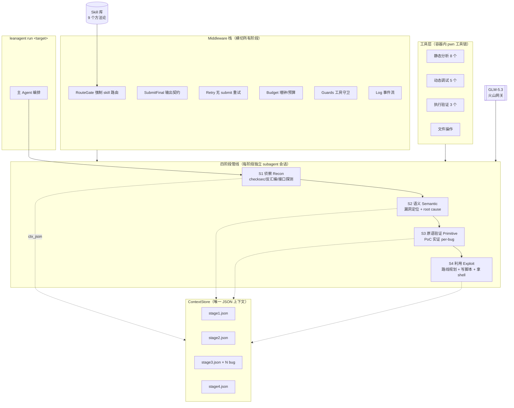
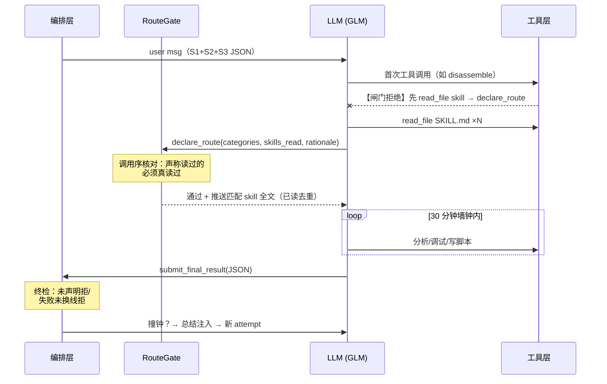
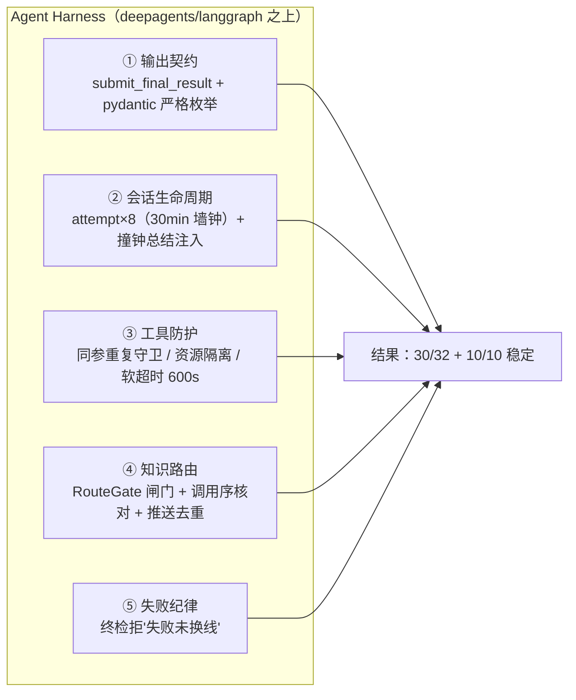
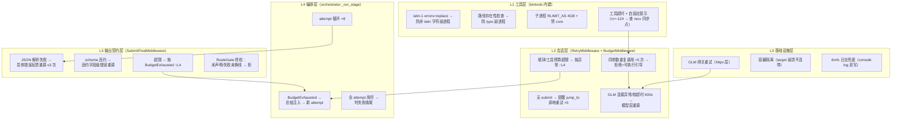

# LeanAgent 架构说明

> LLM 驱动的自动化二进制漏洞挖掘系统。32 题真实 CTF pwn 题实测 **30/32 = 93.75%**，
> 0010 十连跑稳定性 **10/10**。本文覆盖：整体架构、S1-S4 阶段设计、工具层、
> skill 体系、Agent Harness 方案、错误处理层级。

---

## 一、整体架构



**核心设计原则**：
1. **Contract-First**：阶段间只通过结构化 JSON（stage{N}.json 含 ctx_json）传递，
   每个阶段可独立重跑（`--stage N --context prev.json`）
2. **行为逻辑全在 middleware**：编排层（orchestrator）只做 attempt 循环，
   输出校验/重试/预算/守卫全部 middleware 化
3. **知识外置于 skill 库**：方法论不写死在 prompt，按需路由加载

---

## 二、S1-S4 阶段功能与特点

### S1 侦察（Recon）

| 项 | 说明 |
|---|---|
| 职责 | 二进制画像：保护机制、libc 版本、接口（菜单/IO 时序）、攻击面清单 |
| 产物 | ReconReport（binary/security/runtime/interface/attack_surfaces/facts/uncertainties） |
| 特点 | **提交前必查清单**（含依赖解析链劫持检查——0002 题攻关沉淀）；probe_io 实测交互而非猜测 |
| 实测均值 | **3m10s**（最快 1m10s） |

### S2 语义（Semantic）

| 项 | 说明 |
|---|---|
| 职责 | 漏洞定位 + root cause 语义分析（读 S1 报告省去重复侦察） |
| 产物 | VulnerabilityReport（vulnerabilities[]，每 bug 带 bug_id） |
| 特点 | **跨边界调用审查原则**：外部库调用点必查返回值/参数/部分匹配/密码学用法/依赖解析链 |
| 实测均值 | **3m00s** |

### S3 原语验证（Primitive，per-bug）

| 项 | 说明 |
|---|---|
| 职责 | 对每个 bug 推导 primitive → 生成 PoC → 实证执行 → PrimitiveReport |
| 产物 | PrimitiveReport（primitives[]：INFO_LEAK/ARB_WRITE/STACK_CONTROL/CRASH...，VERIFIED/CANDIDATE） |
| 特点 | **两级完成模型**（in_progress 不收，带总结重试）+ **两步写升级法**（先验证单写再验证链）+ **对称枚举**（防 LLM 漏报状态） |
| 实测均值 | **24m20s**（多 bug 题方差大） |

### S4 利用（Exploit）

| 项 | 说明 |
|---|---|
| 职责 | 路线规划 → 攻击链编排 → 写 exploit.py → 执行拿 shell/flag |
| 产物 | ExploitReport（route_planning/exploit_script/execution_result + route_declaration） |
| 特点 | **路线仲裁纪律** + **RouteGate 强制 skill 路由** + **失败未换线终检拒** + 30min×8 attempt + 撞钟总结注入 |
| 实测分布 | 双峰：10 题 <5min 直达，7 题 >1h 攻坚 |



---

## 三、工具层设计（bintools，全量 24 个）

### 设计总纲：**专用工具 > 裸 shell**

LLM 拼 shell 命令是最大失败源（引号错误/输出爆炸/路径 typo 崩主进程）。
每个工具封装一类高频操作，统一处理：输出裁剪（防上下文爆炸）、latin-1
容错（防非 latin 字符崩进程）、资源隔离（RLIMIT）。

### 静态分析组（8 个）

| 工具 | 设计意图与特色 |
|---|---|
| `checksec` | 保护机制一站式（NX/PIE/Canary/RELRO/FORTIFY/**SHSTK/IBT**——CET 检测是实测痛点补的） |
| `elf_info` | ELF 头+段信息（file + readelf 组合） |
| `identify_libc` | **运行时**确认 libc 版本（ldd + strings "GNU C Library"）——不信任文件名 |
| `disassemble` | 按函数名反汇编（objdump），LLM 给符号名即可 |
| `symbols` / `global_vars` / `sections` | 符号表/全局变量/段，全部带 filter + max_lines（防输出爆炸） |
| `got_plt` / `libc_offsets` | GOT/PLT 映射 + libc 符号偏移批量查（**一次调用替代 LLM 手写 readelf 管道**） |

### 动态调试组（5 个）

| 工具 | 设计意图与特色 |
|---|---|
| `gdb_run` | 批处理 GDB：断点+stdin 管道+命令序列。**特色**：①断点未命中自动附加 GDB-HINT（提示检查 stdin 序列而非盲目重试）②子进程 RLIMIT_AS 4GB + 禁 core + 软超时（0021 题 15GB OOM 根治） |
| `gdb_run_crash` | 崩溃分析专用：自动 run→捕获 signal→寄存器/栈/backtrace JSON 化（解析好给 LLM，不吐原始 GDB 输出） |
| `find_offset` | cyclic pattern 自动定位溢出偏移（内置 pwn cyclic） |
| `check_byte` | **写前检查任意地址字节**——"写后检查"翻车点的预防工具（*(target+N) 是否安全） |
| `check_crash_log` | 崩溃日志摘要 |

### 执行验证组（3 个）

| 工具 | 设计意图与特色 |
|---|---|
| `run_binary` | 跑二进制喂 stdin（hex 模式支持二进制 payload）。**特色**：xxd 风格输出 + 泄露段自动标注 |
| `run_script` | 跑 exploit/调试脚本。**特色**：①脚本不存在给明确错误（防路径 typo 崩进程）②rc=-124 超时自动附加"查 recv 同步点"提示 ③**输出摘要化**（只留标记行+Traceback，去噪音省 token） |
| `probe_io` | 交互探测：多步 recv_until/send 序列实测菜单时序。子进程隔离（target 崩溃不连带 agent） |

### 构造辅助组 + 文件组

| 工具 | 设计意图与特色 |
|---|---|
| `make_payload` | 结构化构造二进制 payload（parts 数组：[["A",48],["%p",1],["\x00",1]]）——**LLM 无法在 JSON 字符串里表达 NUL**，此工具是格式串/ROP 题的关键 |
| `search_rop_gadgets` / `find_ret_gadget` | ROP gadget 检索（ROPgadget 封装，keyword 过滤） |
| `cfg` / `list_strings` | 控制流图 / 字符串过滤 |
| `read_file` / `write_file` / `edit_file` / `delete` / `execute` | deepagents 原生文件系统工具（workspace 根目录限定）+ 兜底 shell（execute 保留但 prompt 引导优先用专用工具） |

### 工具层的量化收益（实测）

- `run_script` 输出摘要化：单次调用平均省 **~2K tokens**（只留标记行），50 次/题 = **~100K tokens/题**
- `make_payload`：格式串题 NUL 字节问题的唯一解（JSON 字符串无法表达）
- `gdb_run` 资源隔离：0021 从 OOM 必死 → 稳定跑完

---

## 四、Skill 库编写特点与经验

### 库现状（9 个）

| Skill | 覆盖 | 来源 |
|---|---|---|
| glibc-version-routing | 版本→路线总路由（速查表） | 0004 攻关 |
| fsop | House of Apple 2 全链 | 早期 heap 题 |
| tcache-poisoning | fd 篡改+版本分支 | 0015 |
| blind-oracle-leak | 二分逐位 + 线性页扫描双变体 | 0003 + 0018 |
| format-string | %p/%n 读写基础 | 通用 |
| partial-brute-format-string | 降维暴力（写目标铁律） | 0023 病理修复 |
| rop-ret2libc / got-overwrite / data-only | 基础路线 | 通用 |

### 编写铁律（实战教训浓缩）

1. **只写方法论，不写题目**——通用符号化（param X / 指针 P/Q），不写具体题的地址/槽位
2. **反模式比正模式更重要**——每个 skill 的"❌ 实测翻车点"段落是最高价值内容
   （例：partial-brute 的"❌ 算出 28 bit 随机就放弃——你只需要低 16 位里的 4 bit"）
3. **关键语义精确到会翻车的程度**——"%hn 计数全轮累计不归零，v2<v1 时回绕 0x10000"
   这种细节写模糊了 LLM 必错
4. **skill 之间 [[交叉引用]]**——版本路由表指向具体技能，错误版本上空转是最贵的失败
5. **病理驱动迭代**——skill 修改全部来自真实失败复盘（0023 的"参数预读过度泛化"
   修正、0018 的线性扫描变体合并），不凭空设计

### 最大经验：**知识在库里 ≠ 知识被用**

0018 实测：无闸门 6 attempt SKILL.md 读取 **0 次**。解法是 RouteGate
（见架构）——**把"应该读"变成"不读就干不了"**。

---

## 五、Agent Harness 整体方案



**五个组件的协同**：

| 组件 | 解决的 Agent 顽疾 | 实测证据 |
|---|---|---|
| ① 输出契约 | 无限 prose 不交结论 | v1 179 次调用 0 提交 → v4 10/10 |
| ② 总结注入 | attempt 间失忆 | 0028 a5 开局 5 分钟攻克 |
| ③ 工具防护 | 复读循环/挂死/OOM | 9 小时挂死→10 分钟自愈；15GB OOM 根治 |
| ④ 知识路由 | skill 零检索 | 0018：0 次读取→40 秒 23 次 |
| ⑤ 失败纪律 | 提前放弃 | 0013：24 分钟投降→4h07m 打满 |

**关键哲学**：
- **不信任模型自律**——每个"模型应该会做"的点都变成机制（校验/守卫/闸门）
- **拒绝消息必须可执行**——每次拦截都附带"怎么做"（具体命令/路径/格式），
  LLM 拿到拒绝的下一步就是照做
- **上下文是稀缺资源**——推送去重（~10K tokens/attempt）、输出摘要化、
  总结压缩（工具结果截断 1500 字符）三管齐下

---

## 六、错误处理层级图



### 层级职责表

| 层 | 职责 | 典型错误 | 处理方式 |
|---|---|---|---|
| **L0 基础设施** | 网络/容器/文件系统 | 网关抖动、WSL drvfs 吞文件 | httpx 重试、console log 双写兜底 |
| **L1 工具内建** | 单次工具调用的健壮性 | 非 latin 字符、路径 typo、子进程失控 | errors=replace、isfile 检查、RLIMIT、超时提示 |
| **L2 会话内** | agent 循环的健康 | 无 submit、复读、连接挂死、撞钟 | 原地重试 ×5、重复守卫、软超时 600s、BudgetExhausted |
| **L3 输出契约** | 最终交付质量 | JSON 坏、schema 违约、违规提交 | 字段级反馈重调 ×3、终检拒（RouteGate 联动） |
| **L4 编排** | 跨会话策略 | 单会话穷尽仍失败 | 总结注入新 attempt ×8、彻底失败判负收尾 |

### 设计要点

- **错误向上冒泡，策略向下注入**：L1-L3 的异常最终都以 BudgetExhausted
  形式到达 L4，L4 决定"重试（带总结）还是收尾"
- **每层拒绝消息都是可执行的**：L2 的"修改 stdin 序列后再调"、L3 的
  "route_declaration 字段按声明填写"——LLM 不会陷入"不知道怎么办"的状态
- **两层双保险**：关键约束（如 skill 路由）在 L2（闸门拦截）和 L3（submit
  终检）各拦一次，绕过任何一层都会被另一层接住

---

## 七、目录结构速查

```
leanagent/
├── agent_util.py      # _run_subagent：middleware 组装 + agent 构建 + 异常转总结
├── orchestrator.py    # _run_stage（attempt 循环）+ make_runners（S1-S4 runner）
├── summary.py         # 独立纯 LLM 总结（不走 agent 框架防 retry 劫持）
├── schemas.py         # 4 个 pydantic 报告 schema + ContextStore + 校验
├── agents/            # S1-S4 的 system prompt + user template
├── middleware/
│   ├── route_gate.py  # ★ RouteGate 强制 skill 路由
│   ├── submit_final.py# 输出契约 + 终检
│   ├── retry.py       # 无 submit 重试 + GLM 软超时
│   ├── budget.py      # 墙钟/工具预算/重复检测
│   └── guards.py      # InlineScriptGuard / TruncatedWriteGuard
├── tools/bintools.py  # 24 个 pwn 工具（静态/动态/执行/构造）
└── skills/            # 9 个方法论 skill（渐进披露 + RouteGate 强制路由）
```
